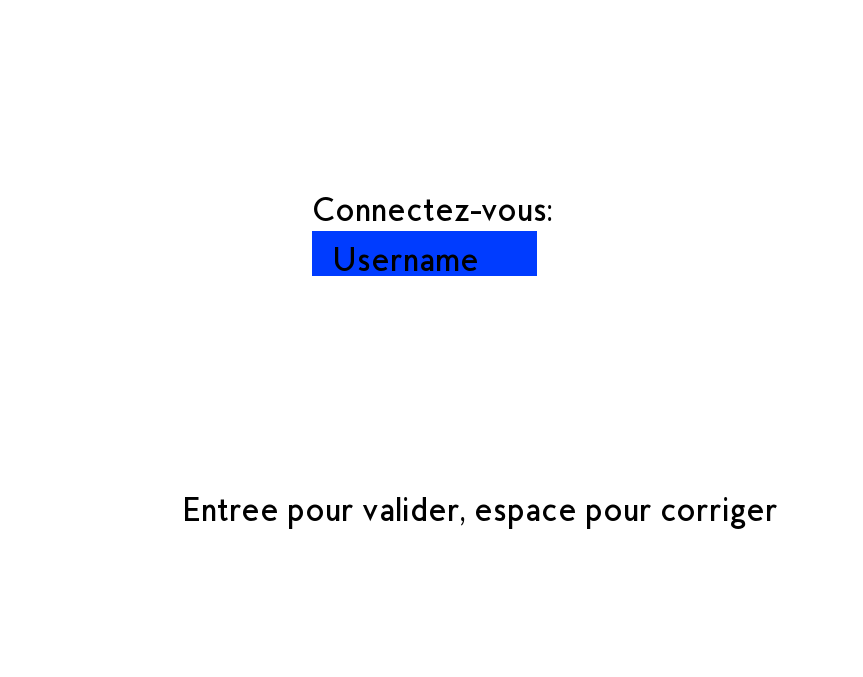
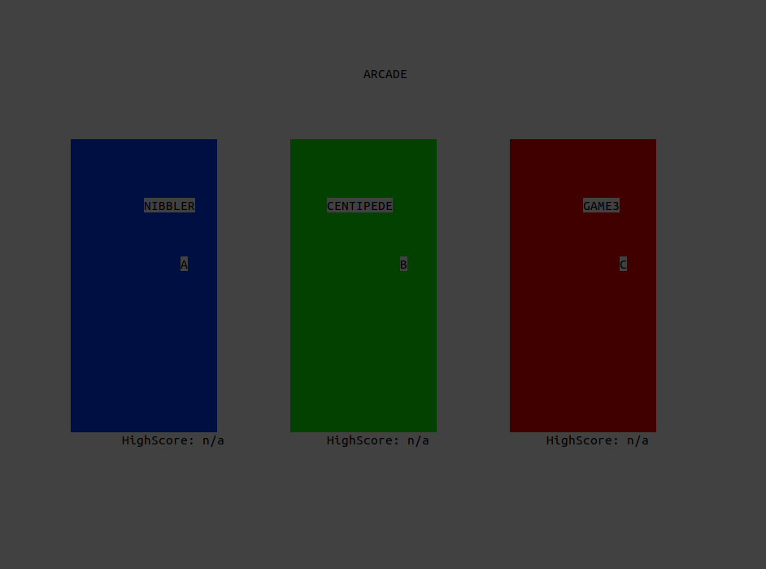
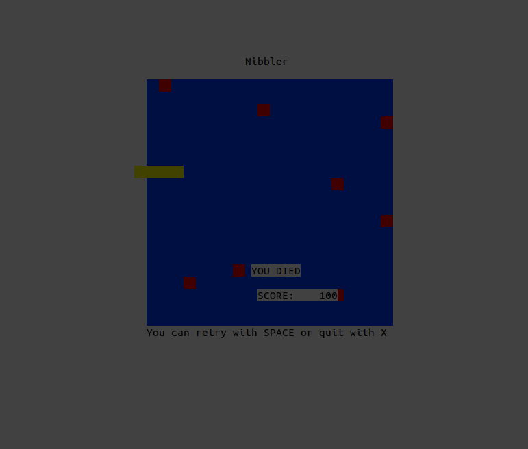

# Arcade (Game console in Ncurses, SFMl and SDL2)

> Ce projet consiste à heberger un serveur sur le port **P** et permettre à **N** clients de s'y connecter pour pouvoir communiquer.

>Les clients peuvent envoyer des **messages privés**, creer un **Channel**, une **Team**, un **Thread**, et poster des **Messages** sur ces derniers.

### Collaboration groups:

> Durant ce projet, nous devions rendre compatible notre moteur de jeu avec le moteur de deux autres groupes

  - leo4.fabre@epitech.eu
  - lucas.decrock@epitech.eu

  
  
  

## Auteurs

👤 **Achille Bourgault**

* Github: [@achillebourgault](https://github.com/achillebourgault)
* LinkedIn: [@achille-bourgault](https://fr.linkedin.com/in/achille-bourgault-266514177)

👤 **Frédéric Lawecki--Walkowiak**

* Github: [@fredericlw](https://github.com/fredericlw)
* LinkedIn: [@frederic-lawecki-walkowiak](https://www.linkedin.com/in/frederic-lawecki-walkowiak/)
